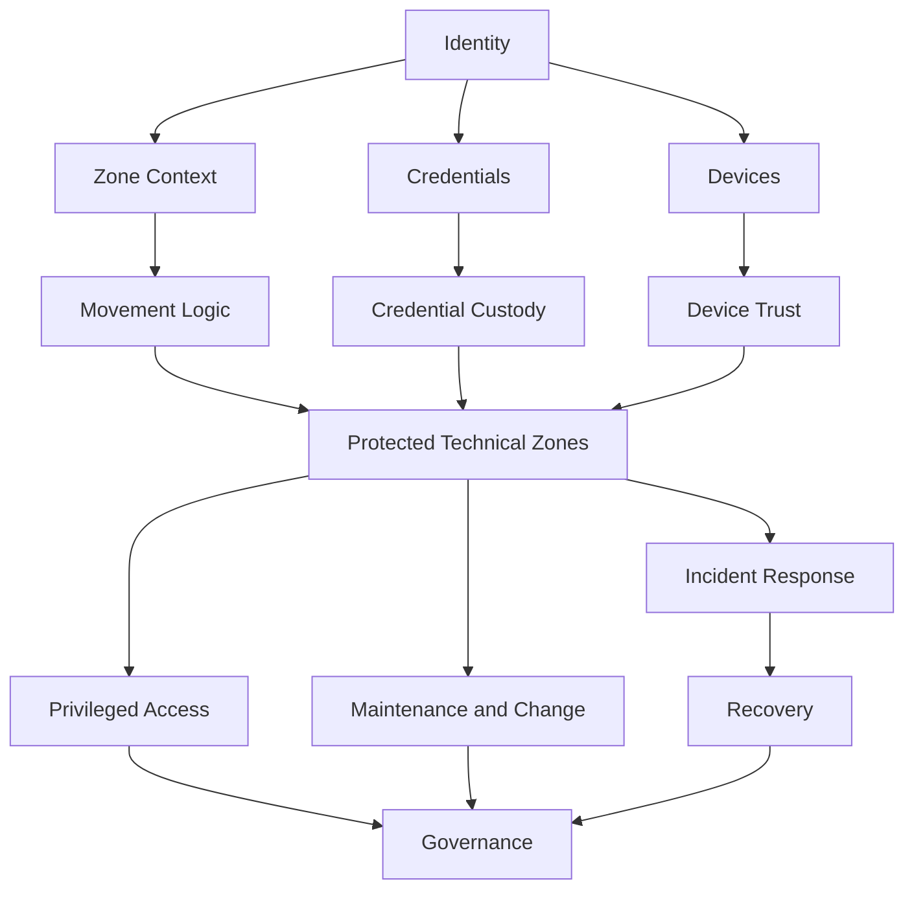
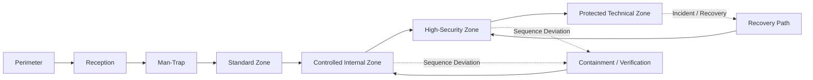
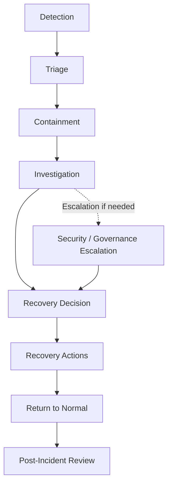
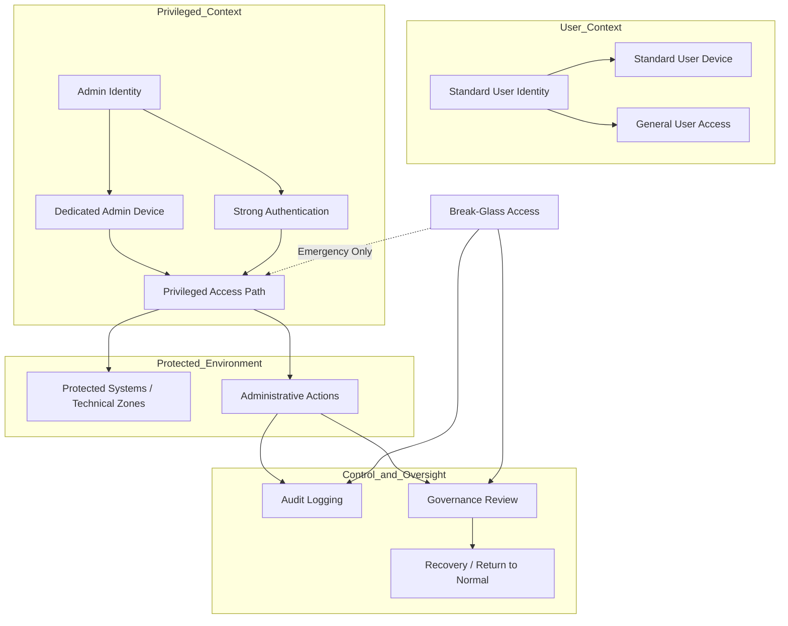

# Diagrams – High-Security Facility Concept

> Visual overviews of key parts of the High-Security Facility Concept.

---

## Purpose

This document collects simple Mermaid diagrams to visualize the most important relationships in the concept.

The diagrams are intended to:

- make the concept easier to understand
- support the README, pitch, and design review
- show how different security domains are connected
- provide a visual entry point into the document set

---

# 1. High-Level Concept Overview

This diagram shows the concept at a high level as one coherent system.

### Notes

- Identity, credentials, and devices act as core carriers of trust.
- Zone context and movement logic influence how trust is assessed.
- Protected technical zones function as a central node where multiple security domains meet.
- Governance and recovery are integrated parts of the model, not side tracks.

---

# 2. Zone Flow Diagram

This diagram shows a simplified example of sequential physical passage through the facility.

### Notes

- Access to higher zones depends on the correct path through prior zones.
- Deviating movement may lead to containment or verification.
- The recovery path is used when normal passage or control needs to be restored.

---

# 3. Incident and Recovery Lifecycle

This diagram shows how incident handling and recovery are connected.

### Notes

- Incidents do not go directly back to reopening or normal operations.
- Recovery should take place through a defined decision and controlled actions.
- Post-incident review is an important part of learning and governance.

---

# 4. Privileged Access Context Diagram

This diagram shows how privileged access is separated from normal use and linked to stronger control, logging, and governance.

### Notes

- Normal use and privileged access are kept in separate contexts.
- Privileged access requires a dedicated identity, a dedicated device, and strong authentication.
- All administrative actions are linked to logging and governance review.
- Break-glass exists as an emergency function, but is explicitly exceptional, controlled, and reviewable.

---

# Suggested Use

These diagrams can be used as:

- overview material in the repository
- supporting material in `concept.md`
- supporting material in `executive-summary.md`
- a quick visual introduction for new readers
- a foundation for more detailed diagrams later

---

# Future Diagram Candidates

Possible future diagrams to add:

- Credential Custody Flow
- Technical Zone Operating States
- Governance and Policy Relationships
- Device Movement and Asset Control Flow

---

# Final Note

The diagrams in this document are intentionally simplified to support rapid understanding.

They should not be seen as full implementation design, but as visual representations of the core logic of the concept.
