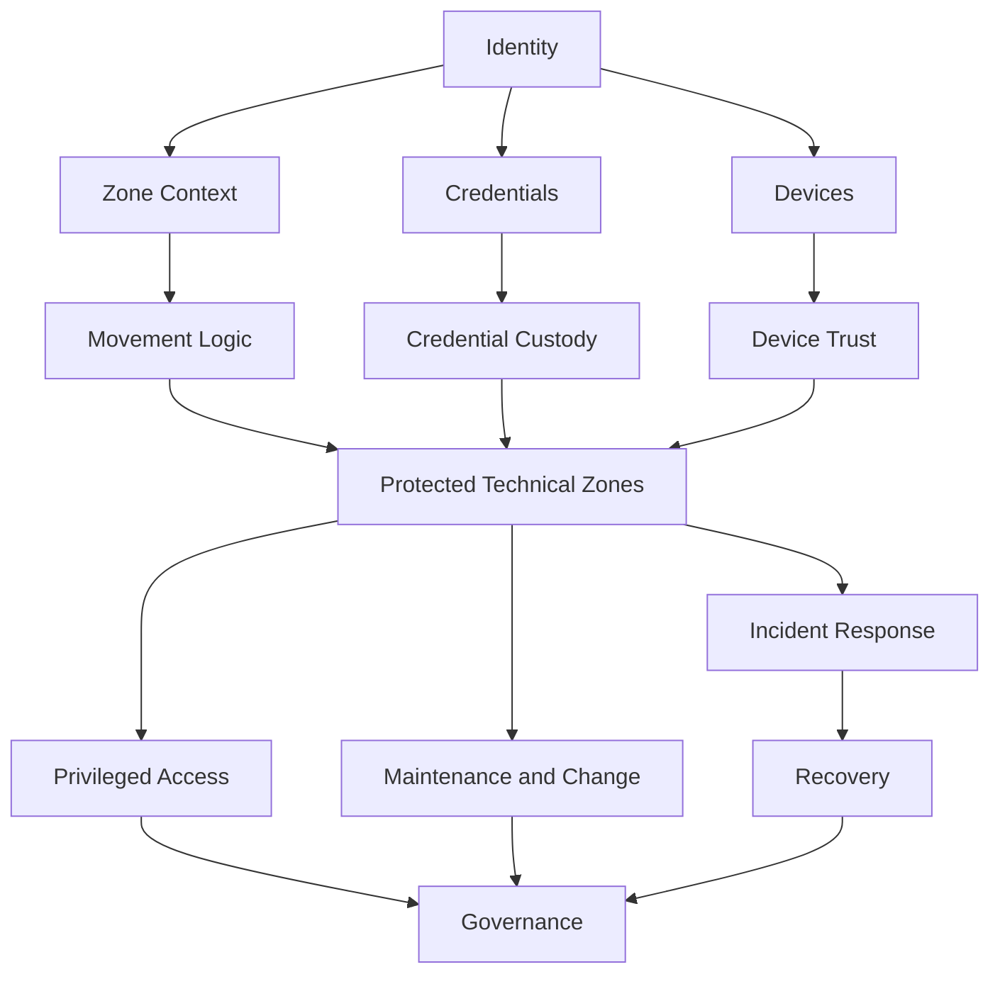
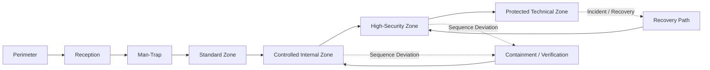
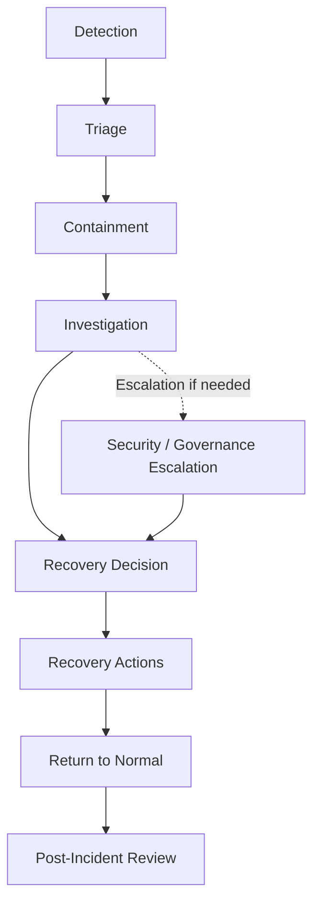

# Diagrams – High-Security Facility Concept

> Visuella översikter över centrala delar av High-Security Facility Concept.

---

## Purpose

Detta dokument samlar enkla Mermaid-diagram för att visualisera konceptets viktigaste samband.

Diagrammen är tänkta att:
- göra konceptet lättare att förstå
- stödja README, pitch och designreview
- visa hur olika säkerhetsdomäner hänger ihop
- ge en visuell ingång till dokumentpaketet

---

# 1. High-Level Concept Overview

Detta diagram visar konceptet på hög nivå som ett sammanhängande system.

### Notes
- Identitet, credentials och devices utgör centrala tillitsbärare.
- Zonkontext och rörelselogik påverkar hur tillit bedöms.
- Skyddade teknikzoner fungerar som en central nod där flera säkerhetsdomäner möts.
- Governance och recovery är integrerade delar av modellen, inte sidospår.

---

# 2. Zone Flow Diagram

Detta diagram visar ett förenklat exempel på sekventiell fysisk passage genom facilityn.

### Notes
- Passage till högre zoner bygger på korrekt väg genom tidigare zoner.
- Avvikande rörelse kan leda till containment eller verifiering.
- Recovery-path används när ordinarie passage eller kontroll måste återställas.

---

# 3. Incident and Recovery Lifecycle

Detta diagram visar hur incidenthantering och recovery hänger ihop.

### Notes
- Incidenter går inte direkt till återöppning eller normaldrift.
- Recovery ska ske via definierat beslut och kontrollerade åtgärder.
- Eftergranskning är en viktig del av lärandet och styrningen.

---

# Suggested Use

Dessa diagram kan användas som:

- översiktsmaterial i repo
- stöd i `concept.md`
- stöd i `executive-summary.md`
- snabb visuell introduktion för nya läsare
- underlag för vidare, mer detaljerade diagram

---

# Future Diagram Candidates

Möjliga framtida diagram att lägga till:

- Privileged Access Context Diagram
- Credential Custody Flow
- Technical Zone Operating States
- Governance and Policy Relationships
- Device Movement and Asset Control Flow

---

# Final Note

Diagrammen i detta dokument är avsiktligt förenklade för att skapa snabb förståelse.

De ska inte ses som full implementationsdesign, utan som visuella representationer av konceptets kärnlogik.
