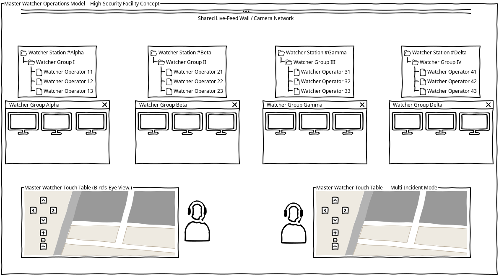

# Master Watcher Operations Model – High-Security Facility Concept

> A facility-aligned human coordination model in which the Master Watcher Operator maintains the facility-wide operational picture while specialized Watcher Operators manage present observation, predictive analysis, historical reconstruction, supplementary anomaly review, assigned areas, patrol tasking, and controlled incident response.

---

## Document Information

| Field | Value |
|---|---|
| Document | Master Watcher Operations Model |
| Subject | Central and distributed security-control operations |
| Type | Supporting Operations Model |
| Status | Conceptual |
| Scope | Master Watcher Operator, specialized Watcher Operators, Watcher stations, patrol guards, camera coordination, calibration, spatial site views, patrol tasking, maneuver control, incident observation, and control handoff |
| Related Areas | Facility Chessboard Coordinate Layer, Fixed Security-Center Orientation, Watcher Station Specialization, Coordinate-Based Composite Site View, Camera Calibration, Incident Coordinate Wrist Display, Incident Maneuver and Door Control, Surveillance, Incident Response, OPSEC, Human Factors |
| Parent Concept | High-Security Facility Concept |

---

## Purpose

This document defines the operational relationship between:

- the facility video wall
- the Master Watcher Operator
- the Master Watcher interface
- the Master Watcher station
- specialized Watcher Operators
- Watcher stations
- patrol guards
- facility cameras
- camera calibration and reference markers
- coordinate-based site views
- floor and zone references
- chessboard coordinates
- incident and movement tracking
- camera-control ownership
- guard assignments
- door and passage control
- operational handoff
- audit and review
- degraded operations
- life-safety coordination

The purpose is to create a layered control-room model in which:

- the Master Watcher Operator maintains the facility-wide picture
- specialized Watcher Operators perform distinct analytical functions
- cameras and sensors support observation and verification
- patrol guards receive minimum actionable tasks
- controlled maneuver functions support authorized incident response
- spatial relationships remain understandable
- responsibility and control remain visible
- uncertainty is communicated honestly
- all relevant actions remain auditable

---

## Core Principle

> **The Master Watcher Operator coordinates the whole facility. Specialized Watcher Operators analyze different aspects of an incident. Patrol guards execute physical tasks.**

The model separates four primary analytical perspectives:

```text
Alpha
Present-state observation

Beta
Short-horizon predictive movement analysis

Gamma
Historical reconstruction and origin analysis

Delta
Supplementary anomaly and additional-actor review

Master Watcher
Facility-wide spatial and temporal coordination
```

The central principle is:

> **Alpha observes the present. Beta anticipates the near future. Gamma reconstructs the past. Delta searches for what may have been missed. The Master Watcher coordinates the complete picture.**

The Master Watcher is both:

- a human operational role
- a facility-aligned interface and station

The system is not intended to replace human judgment with an oversized automated console. It is a human coordination model strengthened by:

- spatial interfaces
- facility coordinates
- camera networks
- camera calibration
- reference markers
- assignment logic
- controlled access information
- passage control
- auditability
- visible uncertainty
- degraded-operation procedures

---

## Conceptual Operations-Room Layout

The following diagram illustrates the physical relationship between the shared camera network, Watcher stations, Watcher Operators, and Master Watcher consoles.



The layout shows:

- a shared live-feed wall and camera network
- Watcher Stations Alpha, Beta, Gamma, and Delta
- three operator positions at each Watcher Station
- dedicated workstation displays for detailed monitoring and zoom control
- a Master Watcher console for facility-wide observation
- a separate Multi-Incident Mode console for simultaneous incident coordination

The diagram is conceptual and does not by itself define:

- final staffing levels
- authority boundaries
- shift structure
- physical-room dimensions
- final equipment selection
- final camera architecture
- certified life-safety design

---

## Terminology

| Term | Meaning |
|---|---|
| **Master Watcher Operator** | The human responsible for the facility-wide operational picture, prioritization, coordination, and escalation. |
| **Master Watcher Interface** | The central facility-aligned interface representing the facility and its operational state. |
| **Master Watcher Station** | The physical workstation where the Master Watcher Operator performs the role. |
| **Watcher Operator** | A human responsible for detailed observation, analysis, or control of an assigned zone, incident, camera group, or operational function. |
| **Watcher Station** | The physical OPSEC workstation used by a Watcher Operator or specialized Watcher team. |
| **Watcher Interface** | The software view used for detailed monitoring, analysis, and control. |
| **Patrol Guard** | A physical responder who executes assigned movement, observation, containment, or support tasks. |
| **Incident Commander** | The person responsible for broader incident authority, response posture, escalation, and return-to-normal decisions where that role is separate. |
| **Incident Maneuver Panel** | A restricted interface for authorized, temporary door and passage control during defined incidents. |
| **Reference Marker** | A surveyed fiducial marker with a known position and orientation used to support camera calibration and facility-coordinate correlation. |
| **Composite Site View** | A spatial operational view combining facility geometry, camera metadata, live-feed references, movement data, and incident state. |
| **Calibration Confidence** | The system’s current confidence that a camera’s registered position and orientation remain accurate. |

A Watcher should not be understood merely as:

- a camera
- a display
- an automated process
- an unnamed user
- an unowned feed

---

## Operational Hierarchy

The operational relationship is:

```text
Master Watcher Operator
Facility-wide coordination, priority, authority, and escalation
        ↓
Specialized Watcher Operators
Present, future, past, and supplementary analysis
        ↓
Watcher Operators
Zone-level observation, camera control, interpretation, and local response
        ↓
Patrol Guards
Physical movement, local observation, and task execution
```

The interface relationship is:

```text
Master Watcher Operator
        ↔
Master Watcher Interface
        ↓
Specialized Watcher Stations
        ↓
Watcher Operators and Watcher Stations
        ↓
Cameras, Zones, Coordinates, Doors, and Patrol Tasks
        ↓
Patrol Guards and Low-Signature Task Displays
```

This hierarchy preserves a separation between:

- overall coordination
- present-state observation
- predictive analysis
- historical reconstruction
- anomaly review
- local interpretation
- physical execution
- interface support
- decision authority

---

## Watcher Station Specialization

The Watcher Station architecture may be divided into specialized analytical functions.

These functions should not be activated at full capacity for every event. They provide a structured way to distribute attention when an incident requires simultaneous observation, prediction, reconstruction, and supplementary review.

### Alpha — Present-State Observation

Watcher Station Alpha focuses on the active, current state of an incident.

Alpha may be responsible for:

- following the active live camera feed
- maintaining observation of a confirmed subject or event
- identifying the current location of an incident
- tracking current movement
- confirming the latest visible state
- maintaining attention on the present observation
- receiving control of a camera after a predictive handoff
- reporting the latest confirmed position
- distinguishing confirmed observation from assumption

Alpha primarily answers:

> **What is happening now?**

Alpha should not be required to abandon the current observation merely to predict where a subject may appear next.

---

### Beta — Short-Horizon Predictive Analysis

Watcher Station Beta focuses on likely near-future movement.

Beta may be responsible for:

- predicting the next likely camera appearance
- analysing movement before and after a blind spot
- reviewing corridors, doors, stairs, and likely routes
- identifying probable reappearance points
- preparing adjacent Watcher Operators
- preparing cameras for a likely handoff
- comparing current movement with expected facility paths
- identifying uncertainty in the prediction
- reporting alternative possible routes

Beta primarily answers:

> **What is likely to happen next?**

Beta does not replace confirmed observation. A prediction must remain visibly distinct from a confirmed location or event.

A typical Alpha-to-Beta workflow may be:

```text
Alpha maintains current observation
        ↓
Subject enters a blind area
        ↓
Beta analyses likely continuation
        ↓
Beta identifies probable reappearance point
        ↓
Relevant camera or Watcher is prepared
        ↓
Alpha continues current observation or transfers control
        ↓
Prediction is confirmed, rejected, or updated
```

This division allows Alpha to remain focused on the current feed while Beta performs short-horizon analysis.
### Gamma — Historical Reconstruction

Watcher Station Gamma focuses on the origin and preceding sequence of an incident.

Gamma may be responsible for:

- reconstructing the subject’s previous movement
- identifying the likely origin of an incident
- reviewing earlier camera events
- examining entrances, roofs, fences, service routes, and access points
- identifying route deviations
- determining whether the subject entered alone
- identifying earlier signs that may be related to the current event
- comparing access records with observed movement
- reporting the last known legitimate or unexplained transition
- identifying possible gaps in the historical record

Gamma primarily answers:

> **How did this begin, and where did the actor come from?**

Gamma supports incident interpretation but should not automatically determine intent or identity. Historical reconstruction remains an analytical input for authorized human decision-making.

---

### Delta — Supplementary Anomaly Review

Watcher Station Delta performs a supplementary review of the incident and searches for information that the other stations may not be considering.

Delta may be responsible for:

- searching for additional actors
- checking for simultaneous movement in other zones
- identifying possible diversionary activity
- reviewing anomalies outside the primary incident area
- challenging incomplete or overly narrow interpretations
- checking whether the incident is larger than initially reported
- identifying camera or sensor inconsistencies
- reviewing possible coordinated-group activity
- checking whether the first explanation remains consistent with available data
- identifying contradictions between independent sources

Delta primarily answers:

> **What else may be happening that the other stations have not considered?**

Delta provides an analytical counterweight to tunnel vision and premature closure. Delta does not automatically override the other stations; it presents additional observations, contradictions, and uncertainties for coordination.

---

## Master Watcher Temporal Coordination

The Master Watcher Operator coordinates the four analytical perspectives rather than treating them as independent incident commands.

The Master Watcher may compare:

```text
Gamma
Where the subject came from

Alpha
Where the subject is now

Beta
Where the subject may appear next

Delta
What else may be happening
```

The Master Watcher Operator may:

- assign or activate specialized Watcher functions
- compare confirmed observations with predictions
- identify contradictions between historical and current data
- coordinate camera-control handoffs
- redirect Beta when a prediction is invalidated
- ask Gamma to review a newly discovered route
- ask Delta to search for additional actors
- consolidate the four perspectives into a shared operating picture
- communicate confidence and uncertainty to the Incident Commander
- reduce or expand the number of active functions as the incident changes

Example activation levels:

```text
Routine or isolated event:
Alpha + Master Watcher

Unclear movement:
Alpha + Beta + Master Watcher

Unknown origin:
Alpha + Gamma + Master Watcher

Possible coordinated incident:
Alpha + Beta + Gamma + Delta + Master Watcher
```

This prevents every incident from creating unnecessary operational complexity.

---

## Master Watcher Operator Role

The Master Watcher Operator is the human responsible for maintaining and coordinating the facility-wide operational picture.

The role includes:

- monitoring the whole facility
- reviewing competing incidents
- prioritizing events
- coordinating Watcher Operators
- activating or deactivating specialized functions
- assigning or approving zone responsibility
- reviewing guard availability
- coordinating patrol assignments
- authorizing operational handoffs
- resolving control conflicts
- monitoring camera ownership
- approving or supervising maneuver sequences
- tracking communication state
- reviewing calibration confidence
- identifying degraded conditions
- escalating beyond local control
- coordinating with the Incident Commander
- supervising return to normal operations

The Master Watcher Operator does not necessarily control every camera or door directly.

The role is primarily responsible for:

```text
Overall picture
→ Priority
→ Coordination
→ Ownership
→ Handoff
→ Escalation
→ Restoration
```

---

## Master Watcher Decision Support

The Master Watcher system may support recommendations without silently becoming the final authority.

Example:

```text
Incident detected at BETA-F6-NE

Suggested Watcher Operator: Watcher-03

Reasons:
- assigned to adjacent zone
- lowest current workload
- required clearance available
- relevant cameras already visible
- PTZ control available
- no conflicting high-priority task
```

The recommended workflow is:

```text
System suggests
        ↓
Master Watcher Operator reviews
        ↓
Assignment is confirmed or changed
        ↓
Watcher Operator acknowledges
        ↓
Audit record is created
```

Possible recommendation factors include:

- geographic or zone responsibility
- workload
- incident priority
- required clearance
- camera availability
- PTZ ownership
- proximity to the affected area
- guard availability
- communications state
- operator fatigue or shift state
- competing incidents
- current degraded-operation level
- camera calibration confidence

The system should show the reasoning behind recommendations.

It should not present a recommendation as an unquestionable decision.

---

## Master Watcher Interface

The Master Watcher is a central, horizontal, touch-enabled facility representation located in the security control room.

It follows the same orientation as the facility and provides:

- spatial selection
- camera discovery
- zone overview
- coordinate selection
- local-sector selection
- incident localization
- temporary camera grouping
- Watcher assignment
- guard assignment
- camera-control coordination
- calibration-confidence visibility
- composite site-view access
- maneuver-panel access
- control handoff
- shared coordination
- system-state visibility

Its primary function is to help the control room answer:

- Where is the event?
- Which floor is affected?
- Which coordinate and local sector are involved?
- Which zone is involved?
- Which cameras cover the area?
- Which camera relationships are verified?
- Which Watcher Operator is responsible?
- Which patrol guard is available?
- What surrounding context must be shown?
- What is the current confidence level?
- Has control or tasking been assigned?
- Has the assigned person arrived?
- Are passage conditions supporting or obstructing response?
- Is life safety clear?
- Is any data stale, unavailable, or contradictory?

---

## Facility Video Wall

The video wall provides a shared room-level view of:

- overall facility status
- active incidents
- selected camera feeds
- floor and zone conditions
- movement indicators
- Watcher assignments
- guard assignments
- door and passage states
- system health
- camera calibration status
- relevant trust-state information
- current operational mode
- life-safety status

The video wall should maintain the same spatial orientation as:

- the physical facility
- the Master Watcher
- Watcher stations
- floor plans
- coordinate maps
- camera maps

Different displays may show different detail.

They must not show conflicting spatial meaning.

---

## Coordinate-Based Composite Site View

The Master Watcher may provide a coordinate-based composite site view that combines facility geometry, camera metadata, live-feed references, movement markers, and incident state into a shared spatial overview.

The purpose is not necessarily to create a seamless photographic panorama.

The view may instead be a spatially accurate operational representation in which live feeds are projected, positioned, or referenced against a facility model.

The composite site view may include:

- facility geometry
- floor and zone boundaries
- facility chessboard coordinates
- camera positions
- camera viewing directions
- camera fields of view
- live-feed references or thumbnails
- active incidents
- movement trails
- last-known positions
- predicted movement paths
- access points
- door and passage states
- camera availability
- calibration confidence
- system uncertainty
- degraded-operation state

The site view should clearly distinguish between:

- confirmed observation
- historical observation
- predicted movement
- inferred position
- unavailable data
- uncertain calibration
- operator-entered information

A predicted path must not be presented as a confirmed physical location.

---

## Calibration and Site Reference Markers

The facility may use surveyed fiducial reference markers at known positions and orientations throughout the building and surrounding site.

These markers may include:

- AprilTags
- ArUco markers
- QR-like machine-readable references
- other suitable fiducial markers

The markers may support:

- camera-pose estimation
- camera-position verification
- camera-orientation verification
- calibration against the facility coordinate layer
- detection of camera displacement
- spatial projection of live feeds
- calibration drift monitoring
- verification of facility metadata

Each marker should have a registered identity and known relationship to the facility coordinate layer.

Example:

```text
Marker ID: M-017
Facility Coordinate: BETA-F6-NE
Known Orientation: Northeast
Registered Height: 2.40 m
Associated Camera Group: CAM-041 to CAM-047
Marker Status: Verified
```

The markers provide geometric reference points. They do not, by themselves, create a complete stitched panorama.

A separate software layer is required to project, align, warp, synchronize, or combine camera feeds against a shared facility model.

The preferred conceptual implementation is:

```text
Known site markers
        ↓
Camera pose and orientation estimation
        ↓
Facility coordinate correlation
        ↓
Camera calibration state
        ↓
Spatial feed projection
        ↓
Coordinate-based composite site view
```

---

## Camera Calibration Confidence

Camera calibration should be treated as operational data rather than as a permanent configuration assumption.

Each relevant camera may maintain a calibration-confidence state:

```text
Verified
Recently Verified
Stale
Uncertain
Failed
Unavailable
```

Calibration confidence may be reduced when:

- a camera is physically moved
- a marker is missing or obscured
- observed marker geometry conflicts with registered geometry
- camera metadata is unavailable
- the camera clock is unreliable
- the camera feed is distorted
- the camera has been subject to impact or maintenance
- another camera reports a conflicting position
- calibration has exceeded its verification interval

A camera with uncertain or failed calibration should not automatically be used for precise spatial projection without operator review.

Calibration confidence should be visible to:

- the Master Watcher Operator
- relevant Watcher Operators
- incident review personnel
- degraded-operation procedures
- audit and recovery processes

The system should not present a calibrated spatial relationship as verified when the underlying evidence is stale or contradictory.
## Reference Marker and Camera Integrity

Reference markers should be treated as part of the facility’s observable security infrastructure.

Where practical:

- markers should be placed in tamper-resistant locations
- marker condition should be observable by more than one camera
- marker movement should be detectable
- camera displacement should be compared against known markers
- contradictory calibration observations should reduce confidence
- marker replacement should require an authorized configuration update
- changes should be logged and reviewed

A marker should not be treated as trusted merely because it is visible.

The system should consider whether:

- the marker is in its registered location
- the marker has the expected orientation
- the marker identity is valid
- the observing camera is itself trusted
- another source confirms the geometry
- the marker may have been covered, replaced, or manipulated

---

## Watcher Operator Role

A Watcher Operator is a human responsible for detailed observation and control within an assigned area, incident, camera group, or operational task.

The role includes:

- monitoring a defined zone
- controlling individual cameras
- following a subject or event
- verifying alerts
- interpreting movement
- checking access and ticket context
- assigning patrol guards within authority
- defining routes and task states
- monitoring guard movement
- confirming arrival
- maintaining observation
- recording events
- coordinating with other Watcher Operators
- transferring responsibility
- escalating when local control is insufficient

The Watcher Operator sees the incident and zone context necessary to act.

A patrol guard may receive only:

```text
THETA:VIII ][ BETA-F6-NE
STAIRS
OBSERVE
```

---

## Watcher Assignment

The Master Watcher Operator may assign a Watcher Operator based on:

- zone responsibility
- floor
- coordinate
- local sector
- camera group
- incident
- subject
- technical area
- access event
- clearance
- current workload
- PTZ availability
- adjacent-zone responsibility
- current communications state
- relevant analytical specialization
- camera calibration confidence

An assignment should identify:

- Watcher station
- operator identity
- area of responsibility
- camera group
- coordinate or zone
- incident reference
- start time
- expected task
- priority
- review or expiry condition
- handoff requirements
- current confidence state
- calibration limitations where relevant

Assignments must be visible to relevant operators.

---

## Guard Assignment

A Watcher Operator or authorized Master Watcher Operator may assign a patrol guard to a coordinate-based task.

The assignment should consider:

- guard availability
- current location
- current task
- access permissions
- equipment status
- incident priority
- route feasibility
- operational condition
- communications state
- whether the guard is already engaged
- whether the route depends on controlled passages
- whether the relevant camera coverage is reliable

A guard already assigned to an active task should not receive a conflicting assignment without explicit authorized reassignment.

Example:

```text
THETA:VIII ][ BETA-F6-NE
ROUTE: STAIRS
TASK: MOVE
```

---

## Guard Call-Sign Structure

A patrol call sign uses:

```text
[Greek Designation]:[Roman Guard Number]
```

Example:

```text
THETA:VIII
```

The assignment format is:

```text
[Call Sign] ][ [Operational Coordinate]
```

Example:

```text
THETA:VIII ][ BETA-F6-NE
```

This is interpreted as:

```text
Guard Call Sign: THETA:VIII
Assigned Coordinate: BETA-F6-NE
```

The call sign does not necessarily indicate the guard’s current physical floor.

A Theta-assigned guard may be sent to Beta because closer guards are unavailable or already occupied.

---

## Patrol Tasking and Low-Signature Delivery

During a defined silent-security incident, the guard may receive a task through:

- wrist-worn e-paper display
- low-power wrist display
- flashlight-mounted LED display
- secured handheld display
- authenticated patrol equipment
- haptic tasking device
- controlled radio fallback

The guard-facing display should show only the minimum actionable information.

Example:

```text
THETA:VIII ][ BETA-F6-NE
STAIRS
MOVE
```

After arrival:

```text
THETA:VIII
BETA-F6-NE
OBSERVE
```

The control room retains the wider context while the guard receives the task required for execution.

The display should not unnecessarily disclose:

- the wider incident narrative
- other personnel identities
- unrelated zones
- full facility structure
- unneeded camera details
- assumptions presented as facts

---

## Radio-Silent Tasking

During Silent Security Mode, the display may reduce the need for spoken radio traffic.

The system may transmit silently:

- call sign
- coordinate
- local sector
- route
- task state
- update
- cancellation
- return instruction

This reduces exposure of:

- incident location
- guard identity
- destination
- route
- response activity
- facility structure
- number of responding personnel

Radio remains available for:

- life-safety events
- unexpected contact
- medical emergencies
- unclear instructions
- escalation
- display failure
- communication failure
- emergency responder coordination

> **Radio silence is a defined operating mode, not a prohibition on speaking when safety or clarity requires it.**

---

## Camera Selection Workflow

When an operator selects a camera on the Master Watcher, the system should:

1. identify the camera
2. identify the camera’s physical coordinate
3. identify the camera’s viewing direction
4. identify the camera’s field of view
5. review camera calibration confidence
6. identify visible site-reference markers
7. compare camera pose with registered facility geometry
8. identify the covered zone
9. display adjacent cameras
10. display relevant access points
11. display related movement
12. display active incident data
13. identify available Watcher Operators
14. identify relevant patrol guards
15. provide a temporary overview of the surrounding zone
16. allow detailed control to be assigned to a Watcher Operator

The selected camera should not be treated as an isolated feed.

The system should help operators understand what is happening around the camera, not only what is visible inside its frame.

---

## Temporary Zone Overview

When a camera, coordinate, or incident is selected, relevant cameras in the associated zone may provide a temporary overview.

This may include:

- fixed cameras
- PTZ cameras
- entry and exit cameras
- adjacent-zone cameras
- corridor cameras
- access-point cameras
- technical-zone cameras
- cameras covering likely movement paths
- cameras observing relevant reference markers

The purpose is to establish:

- what is happening
- where it is happening
- whether movement is expanding
- whether additional actors are present
- whether the event is isolated or connected
- which Watcher Operator should take detailed control
- which guard, if any, should be tasked
- whether the spatial model remains trustworthy

The temporary overview should have a defined duration or termination condition.

It should not permanently override existing responsibilities without authorization.

---

## Overview First, Control Second

The Master Watcher should support:

> **Select one point, reveal the surrounding context, establish a shared overview, then assign detailed control.**

The sequence is:

1. detection
2. localization
3. calibration and data-confidence review
4. contextual overview
5. Watcher Operator assignment
6. specialized analytical assignment
7. guard selection if required
8. detailed observation
9. verification
10. escalation or containment
11. review

This reduces the risk that an operator:

- focuses on one camera too early
- misses adjacent movement
- overlooks a second actor
- fails to identify an exit route
- assumes one feed represents the entire event
- duplicates another operator’s work
- assigns an already occupied guard
- treats a prediction as confirmed
- relies on stale camera geometry

---

## Camera-Control Ownership

Only one Watcher Operator should normally have active manual control of a controllable camera at a time.

The system should clearly display:

- current camera controller
- camera-control status
- control priority
- pending control request
- control lock
- last control action
- time of control transfer

This prevents:

- conflicting PTZ commands
- unexpected camera movement
- duplicated effort
- uncertain responsibility
- assumptions that another operator is controlling the camera

The Master Watcher Operator may authorize or coordinate a control transfer, but detailed camera control should normally remain with the assigned Watcher Operator.

---

## Explicit Control Handoff

A control handoff should be explicit and auditable.

The handoff should identify:

- sending Watcher Operator
- receiving Watcher Operator
- camera or camera group
- coordinate
- local sector
- zone
- subject or event
- current observation state
- current confidence
- last confirmed position
- expected movement
- unresolved limitations
- calibration confidence
- time of transfer
- reason for transfer

Example:

```text
Watcher-01 to Watcher-03:

Subject-01 last confirmed at BETA-F6-NE.
Movement expected toward BETA-G6-W.
Camera control and observation responsibility transferred at 14:36.
Prediction status: UNCONFIRMED.
Calibration status: VERIFIED.
```

Responsibility should not be considered transferred merely because a camera feed was opened at another station.

The receiving Watcher Operator should acknowledge the handoff.

---

## Incident Maneuver and Door Control

The Master Watcher environment may provide access to a restricted Incident Maneuver Panel during defined operational states.

The panel may support:

- door-state visibility
- controlled guard routes
- temporary passage conditions
- access-point sequencing
- movement restriction
- camera and door correlation
- temporary containment
- release and restoration

The panel should be available only when:

- an authorized incident state is active
- the operator has appropriate permissions
- life-safety status is known
- the action is logged
- the action has a defined owner and timeout
- the physical state can be verified or is explicitly marked uncertain

Example:

```text
Coordinate: BETA-F6-NE
Incident State: SILENT SECURITY
Guard: THETA:VIII
Route: STAIRS
Door Sequence: ACTIVE
Camera Coverage: CONFIRMED
Life-Safety State: CLEAR
Door D-12: UNLOCKED FOR PASSAGE
Door D-13: SECURED
```

The Master Watcher Operator may authorize incident-level maneuver actions.

Watcher Operators may request or control assigned lower-consequence passages according to policy.

Critical isolation or exceptional containment may require dual control.

Life safety overrides all security containment.

---

## Shared Operating Picture

The Master Watcher and video wall should provide a common operating picture.

Relevant operators should be able to see:

- active incident
- selected floor
- selected coordinate
- local sector
- affected zone
- associated cameras
- current subject or event
- present observation
- predicted movement
- historical movement
- supplementary anomalies
- confidence state
- calibration confidence
- assigned Watcher Operators
- assigned guards
- guard availability
- camera-control owner
- door and passage states
- current operational mode
- recent movement
- relevant access events
- system limitations
- life-safety status

Different interfaces may show different levels of detail.

They must not show conflicting:

- coordinates
- floor designations
- zone boundaries
- camera locations
- incident states
- guard assignments
- control ownership
- door states
- operational modes
- confidence states

---

## Coordinate Integration

The Master Watcher and Watcher stations should integrate with the Facility Chessboard Coordinate Layer.

A coordinate should support:

- floor selection
- grid-square selection
- local-sector selection
- camera selection
- zone selection
- incident marking
- movement tracking
- last-known-position reporting
- confidence state
- source attribution
- patrol tasking
- route definition
- door and passage relationships
- control handoff
- audit history
- camera calibration correlation

Example:

```text
BETA-F6-NE
```

The system should be able to show:

```text
BETA-F6-NE
→ physical facility position
→ zone
→ camera coverage
→ camera calibration confidence
→ access points
→ door relationships
→ movement history
→ assigned Watcher Operator
→ assigned guard
→ current incident state
```

---

## Context-Bound Authorization Integration

The Master Watcher may support high-risk authorization review by displaying:

- requested zone
- operational floor
- coordinate
- local sector
- ticket holder’s last observed position
- permitted route
- route deviation
- escort status
- current facility state
- relevant cameras
- Watcher assignment
- door and passage context
- calibration confidence of relevant cameras

The Master Watcher provides spatial and operational context.

It does not replace the offline OPSEC verification server or the authorized human decision-maker.

The relationship is:

```text
Offline OPSEC Server
→ verifies ticket and trusted identity data

Master Watcher
→ provides spatial and operational context

Authorized OPSEC Operator
→ makes the accountable decision
```

---

## Operational Modes

### Normal Operations

- normal camera control
- standard facility references
- fixed spatial orientation
- standard Watcher assignments
- routine patrol tasking
- routine audit
- normal access and movement interpretation
- routine camera calibration review
- restricted or unavailable maneuver functions

### Silent Security Mode

- activated after a covert, non-life-threatening security alarm
- selected personnel may use coded directional communication
- relevant camera groups may receive increased observation priority
- Master Watcher displays the affected area
- specialized Watcher functions may be activated
- patrol guards may receive low-signature tasking
- Incident Maneuver Panel may become available according to authority
- camera-control handoff is explicitly tracked
- life safety remains outside the coded layer

### High-Risk Incident Mode

- higher assurance and control requirements apply
- door and passage actions may require elevated authorization
- dual control may be required
- guard tasking is more tightly controlled
- selected zones may be restricted
- ticket and credential verification may be increased
- all temporary access changes are audited
- uncertain camera calibration is escalated

### Compromised Communications Mode

- communication path or device is suspected to be compromised
- affected radios or channels may be invalidated
- new communication conditions may be distributed
- camera and location monitoring may be increased
- device and credential custody may be reviewed
- patrol assignments may be reassigned
- control ownership remains visible
- maneuver actions require explicit confirmation

### Emergency Mode

- life-safety procedures take priority
- explicit physical references are used
- emergency routes remain clear
- coded communication is overridden
- silent patrol tasks may be cancelled or replaced
- emergency responders receive standard references
- security and life-safety operations are coordinated without ambiguity
- door control follows approved emergency behavior
- uncertain spatial data must not obstruct rescue or evacuation
- ## Human Factors

The Master Watcher model should support:

- rapid orientation
- low cognitive load
- shared interpretation
- clear role separation
- visible control ownership
- limited unnecessary interaction
- readable touch targets
- consistent terminology
- clear incident status
- predictable behavior
- easy recovery from operator error
- minimal task information for patrol personnel
- clear door-state interpretation
- visible uncertainty
- clear separation between confirmed and predicted movement

The interface should avoid:

- excessive simultaneous alerts
- unclear camera ownership
- hidden assignments
- unnecessary map rotation
- ambiguous touch targets
- confusing floor labels
- unlabeled temporary states
- control changes without confirmation
- automatic behavior that is not visible
- transferring control-room complexity to guard displays
- showing commanded door states as verified physical states
- hiding life-safety uncertainty
- presenting stale calibration as current
- presenting predicted movement as a confirmed location

> **The system should be cryptic to an unauthorized listener, but obvious to the authorized operator.**

---

## Security and Access Control

Access to the Master Watcher and Watcher functions should be role-based.

Possible permissions include:

### View

- view facility map
- view incident status
- view camera feeds
- view coordinate information
- view door and passage status
- view camera calibration confidence

### Coordinate

- select floors
- select coordinates
- mark observations
- add notes
- update confidence
- define local sectors
- review camera relationships

### Patrol Tasking

- view guard availability
- assign guards
- define routes
- set task states
- cancel assignments
- reassign guards
- review acknowledgement
- review arrival

### Camera Control

- control assigned PTZ cameras
- request camera control
- accept camera handoff
- release camera control
- review camera calibration state

### Maneuver Control

- request passage sequence
- control assigned lower-consequence passages
- review door states
- request temporary unlock
- request route restriction
- release temporary states

### Incident Control

- assign Watcher Operators
- activate specialized functions
- prioritize camera groups
- activate temporary zone overview
- request escalation
- enter or exit defined operational modes
- coordinate with Incident Commander

### Calibration and Configuration

- register reference markers
- modify camera-coordinate associations
- review calibration records
- initiate recalibration
- update facility geometry
- review metadata conflicts

### Administrative Control

- modify floor metadata
- change operational-mode permissions
- review audit records
- manage system configuration
- manage door and passage metadata

High-risk actions should require elevated authorization and should be logged.

---

## Audit and Review

The Master Watcher system should record relevant actions, including:

- user authentication
- role activation
- floor selected
- coordinate selected
- local sector selected
- camera selected
- camera overview activated
- camera-control request
- camera-control handoff
- Watcher Operator assignment
- specialized function activation
- guard assignment
- guard acknowledgement
- task-state change
- route change
- guard reassignment
- arrival confirmation
- maneuver-panel activation
- door command
- door-state verification
- temporary-state timeout
- control transfer
- incident-mode activation
- directional-code status
- observation created
- confidence changed
- calibration state changed
- marker status changed
- note added
- incident closed
- configuration changed
- system failure
- manual override
- emergency override

The audit trail should preserve:

- who acted
- which role was active
- what was selected
- what changed
- when it changed
- why it changed where available
- which incident was active
- which operator held responsibility
- which guard received the task
- which device received the assignment
- which door or passage was affected
- which calibration state was active
- whether the information was confirmed, inferred, or predicted

---

## Failure and Degraded Operations

The facility should define fallback procedures if the Master Watcher or related systems fail.

Possible conditions include:

- Master Watcher unavailable
- video wall unavailable
- Watcher station unavailable
- camera metadata unavailable
- coordinate system unavailable
- control handoff failure
- display synchronization failure
- camera-control conflict
- communications degradation
- patrol display failure
- guard device loss
- maneuver panel failure
- door-state uncertainty
- loss of incident-state information
- loss of Master Watcher Operator
- loss of Watcher Operator
- authority conflict
- camera-calibration confidence reduced
- reference marker unavailable
- reference marker tampering suspected
- camera pose conflict
- composite site view unavailable
- live-feed projection unavailable
- coordinate correlation stale
- camera orientation uncertain
- site-reference metadata mismatch

Fallback procedures may include:

- approved printed floor plans
- controlled coordinate cards
- direct camera identifiers
- standard facility references
- manual Watcher assignment
- manual guard assignment
- manual door verification
- voice confirmation
- manual event logging
- direct camera handoff procedures
- suspension of automated camera grouping
- controlled radio
- task cancellation or reassignment
- hold or deny
- explicit statement of uncertainty
- escalation to Incident Commander
- raw camera feeds without spatial projection
- manual cross-checking against other cameras
- temporary suspension of predictive movement display

If camera calibration or spatial projection cannot be trusted, the system should fall back to:

- raw camera identifiers
- verified camera metadata
- fixed facility references
- approved floor plans
- manually confirmed camera orientation
- direct Watcher Operator interpretation
- explicit uncertainty labels
- manual cross-checking against other cameras

The system must not create a false impression of control when the underlying interface, authority, or data is unreliable.

> **Reduced system confidence must produce controlled fallback, not undefined behavior.**

---

## Authority Continuity

The facility should define who assumes responsibility if the Master Watcher Operator becomes unavailable.

Possible continuity arrangements include:

- designated alternate Master Watcher Operator
- explicit shift handoff
- Incident Commander assumption
- senior Watcher Operator assumption
- manual coordination procedure
- controlled reduction of facility activity

The transition should include:

- current incidents
- active assignments
- specialized Watcher functions
- camera ownership
- calibration state
- door and passage states
- communication mode
- unresolved tasks
- current degraded state
- required follow-up

Responsibility should not be assumed merely because a person begins viewing the same interface.

---

## Life-Safety Compatibility

The Master Watcher is subordinate to life safety.

During life-threatening conditions:

- actual floors and rooms remain available
- physical directions remain explicit
- emergency routes remain clear
- standard evacuation references take priority
- emergency responders do not depend on internal codes
- contextual directional coding is overridden
- silent patrol tasking may be cancelled
- emergency tasking may replace security tasking
- maneuver controls follow approved emergency behavior
- the interface must make life-safety status visible
- uncertain calibration must not obstruct rescue operations

The Master Watcher may still support:

- camera overview
- hazard localization
- evacuation monitoring
- responder coordination
- route monitoring
- zone status
- guard reassignment for rescue support

However, the system must not introduce uncertainty into rescue or evacuation operations.

---

## Design Requirements

The Master Watcher Operations Model should satisfy the following requirements:

- Master Watcher Operator is a defined human role
- Master Watcher Interface and Station are distinct from the operator role
- Watcher Operator is a defined human role
- Watcher Interface and Station are distinct from the operator role
- specialized Watcher functions are explicitly defined
- Master Watcher follows facility orientation
- video wall and Watcher stations share the same orientation
- facility entrance remains a stable reference
- Master Watcher provides shared spatial awareness
- system recommendations show their reasoning
- individual Watcher Operators provide detailed observation and control
- Alpha focuses on present-state observation
- Beta focuses on short-horizon prediction
- Gamma focuses on historical reconstruction
- Delta searches for supplementary anomalies and additional actors
- predictions remain distinct from confirmed observations
- selecting a camera can expose surrounding zone coverage
- temporary camera overviews are clearly indicated
- camera-control ownership is visible
- control handoffs require acknowledgement
- assignments are role-based
- guards are not assigned conflicting tasks without authorized reassignment
- coordinates include operational floor designations
- local sectors are supported
- observations include time, source, and confidence
- active operational mode is visible
- coded communication is separated from physical coordinates
- patrol tasking uses minimum necessary disclosure
- task acknowledgement is available
- movement and arrival can be verified
- maneuver actions have owners and timeouts
- commanded and verified door states are distinguished
- life-safety communication overrides coded communication
- high-risk actions are authorized and auditable
- authority continuity is defined
- degraded-mode procedures exist
- system uncertainty is visible
- manual fallback procedures are documented
- device loss or display failure triggers review
- reference markers have known registered positions
- camera calibration confidence is visible
- marker integrity can be reviewed
- camera displacement can reduce calibration confidence
- coordinate-based composite views distinguish confirmed and predicted information
- spatial projection can be suspended when calibration is uncertain

---

## Relationship to the Wider Architecture

### Facility Chessboard Coordinate Layer

Provides the spatial grid, floor designations, local sectors, doors, camera references, and patrol coordinates.

### Fixed Security-Center Orientation

Ensures that the Master Watcher, video wall, Watcher stations, and facility maps share one spatial orientation.

### Watcher Station Specialization Model

Defines the division between present observation, predictive analysis, historical reconstruction, and supplementary anomaly review.

### Coordinate-Based Composite Site View

Defines how facility geometry, camera metadata, live feeds, movement markers, and incident data may be represented in one spatial overview.

### Camera Calibration and Site Reference Model

Defines reference markers, camera-pose estimation, calibration confidence, drift detection, and spatial correlation.

### Incident Coordinate Wrist Display Model

Defines how patrol guards receive low-signature coordinate assignments, routes, and task states.

### Incident Maneuver and Door Control Model

Defines controlled door and passage actions, temporary states, maneuver sequences, and recovery.

### Surveillance Model

Provides camera visibility, interpretation, verification, calibration support, and response information.

### Incident Response

Defines how events are detected, classified, contained, escalated, and reviewed.

### Context-Dependent Directional Coding

Provides a separate communications-security layer during selected covert security incidents.

### Context-Bound Authorization Ticket

Defines authorization context that may be compared with observed location and movement.

### Offline OPSEC Ticket Verification

Provides high-risk ticket verification and accountable human decision-making.

### Degraded Operations

Defines how the control room, operators, cameras, doors, and patrol tasking remain governable when systems or assumptions are weakened.

### Trust-State Model

Defines how the facility’s operational posture changes as confidence and trust change.

### Audit and Review

Ensures that assignments, control actions, observations, calibration states, door commands, and changes remain reconstructable.

---

## Limitations

The Master Watcher model does not by itself provide:

- complete situational awareness
- accurate camera coverage
- correct identity determination
- reliable subject tracking
- guaranteed predictive accuracy
- communications security
- access authorization
- operator competence
- physical protection
- certified door control
- guaranteed guard availability
- life-safety compliance
- protection against compromised data
- protection against insider misuse
- protection against marker manipulation
- replacement for professional incident command

Its effectiveness depends on:

- reliable facility metadata
- functioning cameras and sensors
- engineered door systems
- authenticated devices
- correctly surveyed reference markers
- valid camera calibration
- trained operators
- trained patrol guards
- clear role separation
- tested procedures
- secure authentication
- accurate control handoff
- reliable task delivery
- explicit authority continuity
- regular review
- disciplined configuration management
- visible uncertainty
- controlled degraded operation

Reference markers support calibration but do not automatically solve all image-stitching, projection, synchronization, or computer-vision problems.

A coordinate-based composite site view should therefore be treated as an operational support capability, not as an unquestionable representation of reality.

---

## Summary

The Master Watcher Operations Model creates a layered human control-room and patrol-coordination structure:

```text
Facility
    ↓
Facility Coordinate Layer
    ↓
Reference Markers and Camera Calibration
    ↓
Coordinate-Based Composite Site View
    ↓
Video Wall and Master Watcher Interface
    ↓
Master Watcher Operator
    ↔
Specialized Watcher Stations
    ├── Alpha: Present-State Observation
    ├── Beta: Short-Horizon Prediction
    ├── Gamma: Historical Reconstruction
    └── Delta: Supplementary Anomaly Review
    ↓
Cameras, Zones, Coordinates, Doors, and Incident Actions
    ↓
Patrol Guards and Low-Signature Task Displays
```

The Master Watcher Operator provides:

- facility-wide spatial awareness
- temporal coordination
- priority management
- Watcher coordination
- guard coordination
- incident escalation
- control ownership
- handoff oversight
- maneuver authorization
- degraded-state coordination
- restoration oversight

The Master Watcher Interface provides:

- rapid camera and zone discovery
- shared incident context
- coordinate selection
- local-sector precision
- temporary camera overview
- composite site view
- calibration-confidence visibility
- Watcher assignment
- guard assignment
- door and passage context
- operational coordination

The specialized Watcher functions provide:

- **Alpha:** detailed observation of the present
- **Beta:** short-horizon prediction of likely movement
- **Gamma:** reconstruction of the past and likely origin
- **Delta:** supplementary review of anomalies and additional actors

Watcher Operators provide:

- detailed observation
- camera control
- movement tracking
- verification
- guard tasking
- local maneuver requests
- escalation
- incident ownership
- controlled handoff
- operational logging

Patrol guards provide:

- physical response
- local observation
- task execution
- arrival confirmation
- escalation when required

Together, they create a control model in which:

> **The Master Watcher Operator coordinates the whole facility, specialized Watcher functions divide analytical attention, Watcher Operators control assigned details, and patrol guards receive the correct task without receiving unnecessary incident information.**

---

## Final Design Principles

> **The Master Watcher is a human operational role strengthened by a facility-aligned interface.**

> **Overview is centralized, responsibility is assigned, control is visible, and every handoff is deliberate.**

> **Alpha observes the present. Beta anticipates the near future. Gamma reconstructs the past. Delta searches for what may have been missed. The Master Watcher coordinates the complete spatial and temporal picture.**

> **A coordinate-based composite site view may provide shared spatial awareness without depending on a single elevated camera.**

> **Reference markers support camera calibration, but calibration confidence must remain visible, reviewable, and subject to degraded-operation handling.**

> **The control room sees the whole incident; the patrol guard receives the minimum actionable task.**

> **Predicted movement must remain visibly distinct from confirmed movement.**

> **Maneuver functions shape authorized passage conditions but never replace human verification or life-safety authority.**

> **Every temporary door state has an owner, a timeout, and a verified ending.**

> **Life safety overrides silent tasking, coded communication, and security containment.**

> **A camera that cannot establish a reliable spatial relationship must not silently appear spatially precise.**
